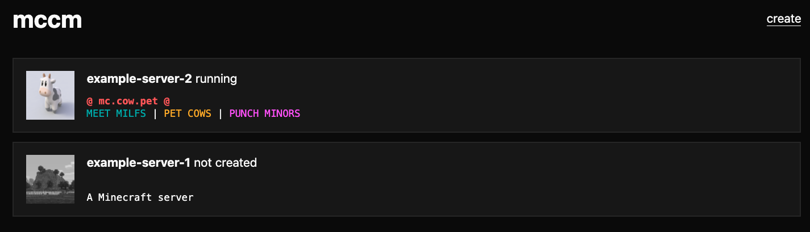

# mccm (minecraft container manager)

manage your minecraft servers easily with mccm!

todo:

- support modifying mc-router
- support backup configuration
- server display (rcon, docker compose logs)

## why make another minecraft container manager?

minecraft server managers like [pterodactyl](https://pterodactyl.io/) and [pufferpanel](https://pufferpanel.com/) aren't half as flexible, convenient, or feature complete as a docker compose file with [itzg's minecraft container](https://github.com/itzg/docker-minecraft-server). the tooling around around itzg's container is really best-in-class: [easy mod and plugin management](https://docker-minecraft-server.readthedocs.io/en/latest/mods-and-plugins/), [server routers](https://github.com/itzg/mc-router), [monitors](https://github.com/itzg/mc-monitor), [server proxies](https://github.com/itzg/docker-mc-proxy), [backups](https://github.com/itzg/docker-mc-backup), and more.

it's a shame the itzg ecosystem isn't accessible to current managers; i still need to ssh into my box to start and servers, docker compose attach to op players (and accidently stop the server when i ctrl+C), copy and paste my configurations, etc

I tried [minepanel](https://minepanel.ketbome.lat/) since it seemed to promise a bridge between server managers and itzg. unfortunately, it's pretty buggy (logs sometimes don't work or is all highlighted as an error, the toast system is super broken on firefox, the templates tab is broken, enabling backups causes the save changes to error, setting TYPE in Advanced > Environment Variables mysteriously disappears on reloading, the "Stopped" badge isn't reactive on the side panel, and many other bugs) and has a couple of questionable design decisions, but i can live with these things. the dealbreaker was taking custody of my docker compose files--it'll overwrite changes you make to them, so extensibility is much more difficult.

the state of self hosted minecraft server managers has finally convinced me this problem is worth trying to solve
